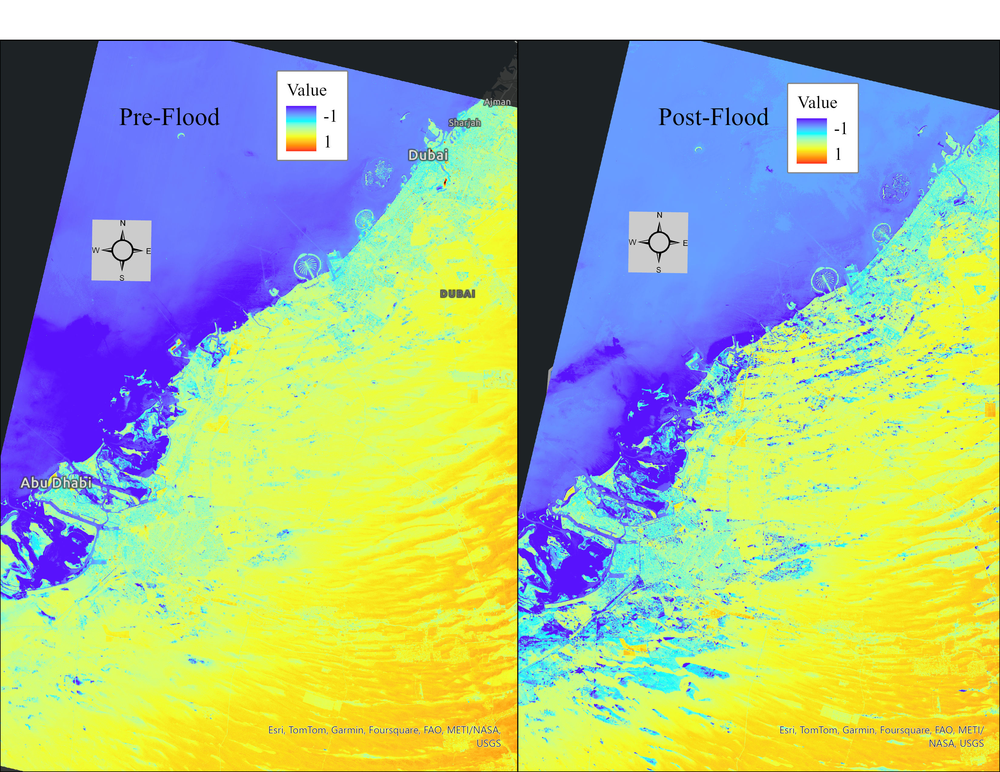

# Title: Analysis of Unprecedented Floods in UAE

| By MUHAMMAD AREEB|
|---------------------------------------------------------------------------------|
| Bachelors of Science in Geographic Information Systems & Technology |
| University of Arizona |
| Course: GIST 483 |
| [officialareeb@outlook.com](mailto:officialareeb@outlook.com) |

### Link to Paper
[Paper](./Final%20Project%20Submission.pdf)

## SUMMARY

### Description:

This project aims to study the effects of the UAE floods during April 2024, by comparing pre-flood and post-flood Landsat-8 imagery and calculating water indices NDWI (Normalized Difference Water Index) and MNDWI (Modified Normalized Difference Water Index).

### Data Sources:

| **Parameter**                  | **Data Source**                                                              |
|--------------------------------|------------------------------------------------------------------------------|
| Landsat -8 Imagery | [USGS](https://earthexplorer.usgs.gov/)                                                           |

### Methods:

The project aims to compare the surface water level using NDWI and MNDWI indices.

$$NDWI = \frac{\text{Green} - \text{NIR}}{\text{Green} + \text{NIR}}$$
$$MNDWI = \frac{\text{Green} - \text{SWIR}}{\text{Green} + \text{SWIR}}$$
## Results and Conclusions:

### Pre-flood and Post-flood comparison

### Change Matrix

|**Classes**	|**0(Dry)**|	**1(Water)**|**Total**|
|---------------|----------|----------------|---------|
|0(Dry)|	17587144|	10324640|	27911784|
|1(Water)|	1951|	12046404|	12048355|
|Total|	17589095|	22371044|	39960139|
